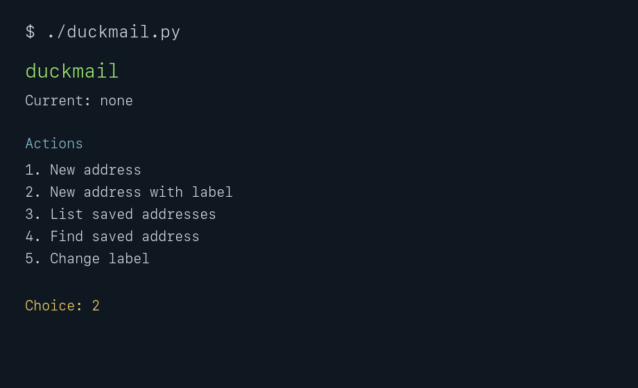

# duckmail

Small terminal helper for DuckDuckGo Email Protection private addresses.



## Why I built this

I use DuckDuckGo Email Protection and wanted a faster way to generate private
`duck.com` addresses, with local labels like `github`, `banking`, or
`newsletters`. DuckDuckGo's apps and browser extensions already generate private
addresses; duckmail is a small helper for people who prefer a local workflow and
want to remember which address was used where.

DuckDuckGo documents generating Private Duck Addresses through their apps,
browser extensions, and Email Protection settings. This tool uses the same
network endpoint that those clients use:

```text
POST https://quack.duckduckgo.com/api/email/addresses
Authorization: Bearer <token>
```

That endpoint is not a formally documented public API, so it can change.

## Requirements

- Python 3.8+.
- A DuckDuckGo Email Protection account and bearer token.
- macOS only if you want to use `DuckMail.app`; the CLI works anywhere Python
  does.

## Installation

Clone the repo and run the CLI:

```sh
git clone https://github.com/buhusa/duckmail.git
cd duckmail
./duckmail.py
```

On macOS, you can also download the ZIP from GitHub, unzip it, and double-click
`DuckMail.app`.

## Security note

- Your DuckDuckGo Email Protection bearer token is stored only on your machine.
- By default it is written to `.duckmail/config.json` inside the project folder.
- The config file is saved with file mode `0600` so only your local user can
  read it.
- Treat the bearer token like a password. Anyone with the token may be able to
  generate private Duck Addresses for your account.
- duckmail uses an internal DuckDuckGo endpoint observed from DuckDuckGo's own
  clients. It is not an official public API and may change or stop working
  without notice.
- Address history and labels are local only. DuckDuckGo does not provide a
  stable dashboard/API for listing every generated Private Duck Address, so keep
  your config backed up if you rely on those labels.

## Setup

1. Open `https://duckduckgo.com/email/` once in a logged-in browser.
2. Open browser developer tools, then the Network tab.
3. Generate a Private Duck Address.
4. Find the `addresses` request and copy the value after
   `Authorization: Bearer`.
5. Store it locally:

```sh
./duckmail.py setup
```

The token is stored in the project folder at `.duckmail/config.json` with file
mode `0600`.
Treat the token like a password.

## Usage

### macOS app menu

Double-click `DuckMail.app` to open the duckmail menu in Terminal. The app bundle
is a lightweight launcher: it opens Terminal, changes into the project folder,
and runs `./duckmail.py`.

The app does not run a background service and does not store anything outside
the local duckmail config file.

### Terminal menu

Run the interactive menu:

```sh
./duckmail.py
```

The interactive menu redraws in place after each action, so the terminal does
not keep scrolling while you use it.

### Commands

Generate a new address:

```sh
./duckmail.py new
```

Generate a new address and save a label:

```sh
./duckmail.py new --label github
```

Same thing, as a more explicit command:

```sh
./duckmail.py new-with-label github
```

Show the last generated address:

```sh
./duckmail.py show
```

List all locally remembered addresses:

```sh
./duckmail.py list
```

Example output:

```text
Saved Duck addresses
--------------------
LABEL       ADDRESS              CREATED
----------  -------------------  ----------------
github      example@duck.com     2026-05-01 at 22:44
```

Search labels and addresses:

```sh
./duckmail.py find github
```

Change an existing label by address or current label:

```sh
./duckmail.py relabel example@duck.com banking
./duckmail.py relabel old-label new-label
```

Show the config path:

```sh
./duckmail.py where
```

Use a custom config path:

```sh
./duckmail.py new --config /path/to/config.json
```

History is stored locally in the same config file. Timestamps are shown in local
time as `YYYY-MM-DD at HH:MM`.

## Author

Created by [buhusa](https://x.com/buhusa).

## License

MIT
